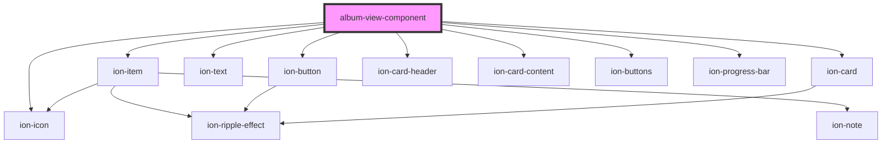

# album-view-component

<!-- Auto Generated Below -->

## Properties

| Property      | Attribute     | Description | Type      | Default     |
| ------------- | ------------- | ----------- | --------- | ----------- |
| `albumtitle`  | `albumtitle`  |             | `string`  | `undefined` |
| `description` | `description` |             | `string`  | `undefined` |
| `energy`      | `energy`      |             | `number`  | `0`         |
| `gaveEnergy`  | `gave-energy` |             | `boolean` | `false`     |
| `idx`         | `idx`         |             | `string`  | `undefined` |
| `num`         | `num`         |             | `number`  | `0`         |
| `position`    | `position`    |             | `number`  | `0`         |
| `top`         | `top`         |             | `number`  | `10`        |

## Events

| Event           | Description | Type               |
| --------------- | ----------- | ------------------ |
| `energyUpdated` |             | `CustomEvent<any>` |

## Dependencies

### Depends on

- ion-item
- ion-button
- ion-icon
- ion-text
- ion-card
- ion-card-header
- ion-card-content
- ion-buttons
- ion-progress-bar

### Graph

----------------------------------------------

*Built with [StencilJS](https://stenciljs.com/)*
